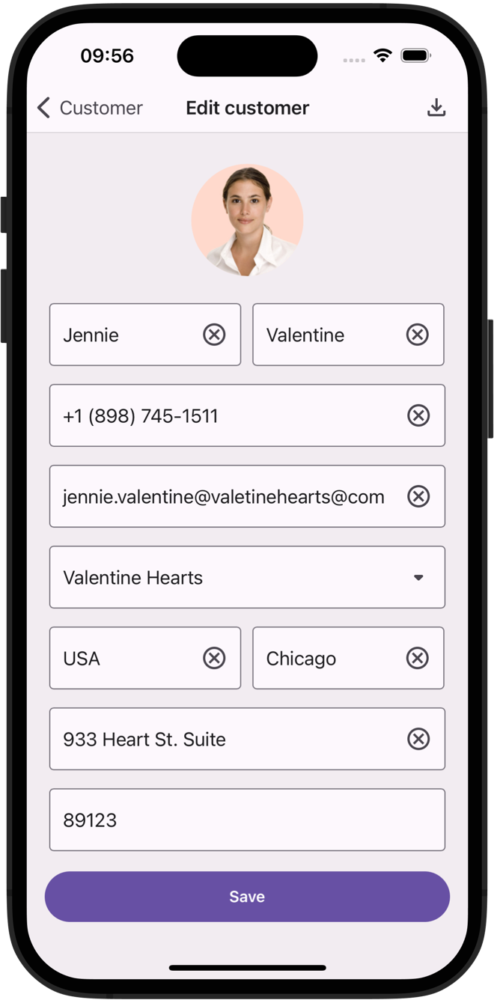

<!-- default badges list -->

<!-- default badges end -->
# DevExpress CRM Demo for .NET MAUI

This repository includes a sample CRM application created with the [DevExpress .NET MAUI UI](https://www.devexpress.com/maui/) component suite.

Use the following link to obtain the CRM Demo on Test Flight/Google Play:

[CRM Demo on Google Play](https://play.google.com/store/apps/details?id=com.devexpress.CrmDemo&pcampaignid=web_share) | [CRM Demo on TestFlight](https://testflight.apple.com/join/R4YeuQ49)

The demo app includes the following features/capabilities: 

## CRUD Views

Mobile-friendly CRUD flow (using an SQLite database): 

[Related Documentation Topic](https://docs.devexpress.com/MAUI/404421/collection-view/crud/crud-overview)

## Filtering UI

Basic and advanced .NET MAUI filtering UI elements:

[Related Documentation Topic](https://docs.devexpress.com/MAUI/404126/collection-view/filter-sort-and-group-data#create-filtering-ui)

## CollectionView Master-Detail

Master-detail view that leverages the DevExpress .NET MAUI BottomSheet control to display selected item info:

[Related Documentation Topic](https://docs.devexpress.com/MAUI/404351/scenarios/bottomsheet)

## DataGrid Export

Export .NET MAUI DataGrid data to Excel and PDF:

[Related Documentation Topic](https://docs.devexpress.com/MAUI/404377/data-grid/export)

## Import to a DataGrid

Import Excel file data and display it within the DevExpress .NET MAUI DataGrid:

## Document Processing

Document processing using the DevExpress Office File API library:

[Related Documentation Topic](https://docs.devexpress.com/MAUI/404434/office-file-api-support)

## Reporting

Report generation powered by DevExpress Reports:

[Related Documentation Topic](https://docs.devexpress.com/XtraReports/404425/dot-net-maui-reporting/use-reporting-in-maui-apps)

## Material Design 3

Material Design 3 theme support:

[Related Documentation Topic](https://docs.devexpress.com/MAUI/404636/common-concepts/themes)

## Data Visualization

Data visualization using charts and circular gauge:

[Related Documentation Topic](https://docs.devexpress.com/MAUI/403300/charts/charts)

## Requirements

To build the project, please register the DevExpress NuGet Gallery in Visual Studio and restore NuGet packages used in this solution. See the following topic for more information in this regard: [Get Started with DevExpress Mobile UI for .NET MAUI](https://docs.devexpress.com/MAUI/403249/get-started).

> The DevExpress .NET MAUI PDF Viewer and HTML Edit controls require a DevExpress [Universal Subscription](https://www.devexpress.com/subscriptions/universal.xml). Without a valid/active license, you cannot use these controls within your .NET MAUI application.

If you are new to our .NET MAUI product line, please refer to the following YouTube video to get started and learn some of what’s possible when using our .NET MAUI libraries: [Setting up a .NET MAUI Project](https://www.youtube.com/watch?v=juJvl5UicIQ).

## Documentation

- [Data Grid](https://docs.devexpress.com/MAUI/403255/data-grid/data-grid)
- [Charts](https://docs.devexpress.com/MAUI/403300/charts/charts)
- [Data Form](https://docs.devexpress.com/MAUI/403640/data-form)
- [Navigation](https://docs.devexpress.com/MAUI/403297/navigation/index)
- [Data Editors](https://docs.devexpress.com/MAUI/403427/editors/index)
- [Collection View](https://docs.devexpress.com/MAUI/403324/collection-view/index)
- [Form Items](https://docs.devexpress.com/MAUI/404418/form-items/form-items)

## More Examples

* [Demo Center](https://github.com/DevExpress-Examples/maui-demo-app)
* [Data Grid](https://github.com/DevExpress-Examples/maui-data-grid-get-started)
* [Collection View](https://github.com/DevExpress-Examples/maui-collection-view-get-started)
* [Data Editors](https://github.com/DevExpress-Examples/maui-editors-get-started)
* [Data Form](https://github.com/DevExpress-Examples/maui-data-form-get-started)
* [Charts](https://github.com/DevExpress-Examples/maui-charts)
* [Scheduler](https://github.com/DevExpress-Examples/maui-scheduler-get-started)
* [Popup](https://github.com/DevExpress-Examples/maui-popup-get-started)
