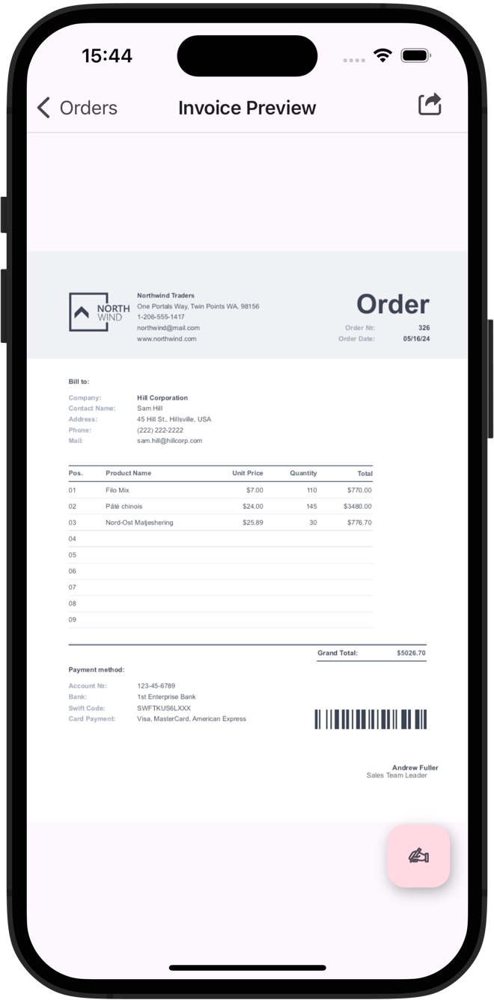

<!-- default badges list -->

<!-- default badges end -->
# maui-crm-demo

# DevExpress Mobile UI for .NET MAUI

This repository includes the CRM sample application created with our [DevExpress Mobile UI](https://www.devexpress.com/maui/) suite.

Refer to the following link to get the CRM Demo on Test Flight and Google Play:

[CRM Demo on Google Play](https://play.google.com/store/apps/details?id=com.devexpress.CrmDemo&pcampaignid=web_share) | CRM Demo on TestFlight

The demo shows the following features:

## CRUD Views

Mobile-friendly CRUD flow with data retrieved from an SQLite database:

[Related Documentation Topic](https://docs.devexpress.com/MAUI/404421/collection-view/crud/crud-overview)

## Filtering UI

Basic and advanced filtering elements:

[Related Documentation Topic](https://docs.devexpress.com/MAUI/404126/collection-view/filter-sort-and-group-data#create-filtering-ui)

## CollectionView Master-Detail

Master-detail view that uses the BottomSheet control to display the selected item's details:

[Related Documentation Topic](https://docs.devexpress.com/MAUI/404351/scenarios/bottomsheet)

## DataGrid Export

Export DataGrid's data to Excel and PDF:

[Related Documentation Topic](https://docs.devexpress.com/MAUI/404377/data-grid/export)

## Import to a DataGrid

Import Excel file data to DataGrid:

## Document Processing

Document processing via the Office File API library:

[Related Documentation Topic](https://docs.devexpress.com/MAUI/404434/office-file-api-support)

## Reporting

Report generation powered by our Reporting suite:

[Related Documentation Topic](https://docs.devexpress.com/XtraReports/404425/dot-net-maui-reporting/use-reporting-in-maui-apps)

## Material Design 3

Material Design 3 theme support:

[Related Documentation Topic](https://docs.devexpress.com/MAUI/404636/common-concepts/themes)

## Data Visualization

Data visualization with charts and circular gauge:

[Related Documentation Topic](https://docs.devexpress.com/MAUI/403300/charts/charts)

## Requirements

To build the project, please register the DevExpress NuGet Gallery in Visual Studio and restore NuGet packages used in this solution. See the following topic for more information: [Get Started with DevExpress Mobile UI for .NET MAUI](https://docs.devexpress.com/MAUI/403249/get-started).

> The DevExpress .NET MAUI PDF Viewer and HTML Edit controls require a license to our [Universal Subscription](https://www.devexpress.com/subscriptions/universal.xml). Without a valid license, you cannot use these controls within your .NET MAUI application.

You can also refer to the following YouTube video to get started with the DevExpress .NET MAUI Controls: [Setting up a .NET MAUI Project](https://www.youtube.com/watch?v=juJvl5UicIQ).

## Documentation

- [Data Grid](https://docs.devexpress.com/MAUI/403255/data-grid/data-grid)
- [Charts](https://docs.devexpress.com/MAUI/403300/charts/charts)
- [Data Form](https://docs.devexpress.com/MAUI/403640/data-form)
- [Navigation](https://docs.devexpress.com/MAUI/403297/navigation/index)
- [Data Editors](https://docs.devexpress.com/MAUI/403427/editors/index)
- [Collection View](https://docs.devexpress.com/MAUI/403324/collection-view/index)
- [Form Items](https://docs.devexpress.com/MAUI/404418/form-items/form-items)

## More Examples

* [Demo Center](https://github.com/DevExpress-Examples/maui-demo-app)
* [Data Grid](https://github.com/DevExpress-Examples/maui-data-grid-get-started)
* [Collection View](https://github.com/DevExpress-Examples/maui-collection-view-get-started)
* [Data Editors](https://github.com/DevExpress-Examples/maui-editors-get-started)
* [Data Form](https://github.com/DevExpress-Examples/maui-data-form-get-started)
* [Charts](https://github.com/DevExpress-Examples/maui-charts)
* [Scheduler](https://github.com/DevExpress-Examples/maui-scheduler-get-started)
* [Popup](https://github.com/DevExpress-Examples/maui-popup-get-started)
